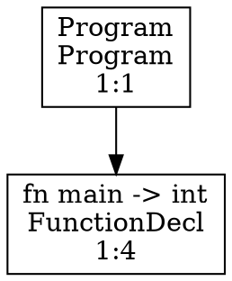

# MiniCompiler - Sprint 3

A lexer, parser, and semantic analysis implementation for a simple programming language, building and validating an Abstract Syntax Tree (AST) with type annotations.

## Project Overview

**MiniCompiler** is a two-stage compiler project:
- **Sprint 1 (Lexer)**: Tokenizes source code with support for comments, strings, numbers, identifiers, keywords, and operators
- **Sprint 2 (Parser)**: Parses tokens into an Abstract Syntax Tree using recursive descent parsing

## Project Structure

```
lex/
├── src/
│   ├── lexer/                  # Lexical analysis (Sprint 1)
│   │   ├── __init__.py
│   │   ├── scanner.py         # Tokenizer
│   │   ├── token.py           # Token definitions
│   │   └── preprocessor.py    # Comment/directive handling
│   ├── parser/                 # Syntax analysis (Sprint 2)
│   │   ├── __init__.py
│   │   ├── parser.py          # Recursive descent parser
│   │   ├── ast.py             # AST node definitions
│   │   ├── ast_visitors.py    # AST traversal (visitor pattern)
│   │   └── grammar.txt        # Formal grammar (EBNF)
│   └── main.py                 # Entry point
├── tests/
│   ├── lexer/                  # Lexer tests
│   │   ├── valid/              # Valid input cases
│   │   └── invalid/            # Invalid input cases
│   ├── parser/                 # Parser tests (structure ready)
│   └── inline_tests.py         # Inline test utilities
├── test_runner/
│   └── run_tests.py            # Test execution script
├── examples/
│   └── program.src            # Example program
├── docs/
│   └── language_spec.md        # Language specification
├── sprint2.md                   # Sprint 2 requirements
└── README.md                    # This file
```

## Language Specification

### Supported Tokens

**Keywords:** `if`, `else`, `while`, `for`, `fn`, `struct`, `return`, `true`, `false`, `int`, `float`, `bool`, `void`

**Operators:** `+`, `-`, `*`, `/`, `%`, `==`, `!=`, `<`, `<=`, `>`, `>=`, `&&`, `||`, `!`, `=`, `+=`, `-=`, `*=`, `/=`, `->`

**Delimiters:** `(`, `)`, `{`, `}`, `[`, `]`, `;`, `,`, `:`

**Literals:** integers, floats, strings (with basic escape sequences), booleans

**Comments:** 
- Line comments: `// ...`
- Block comments: `/* ... */`

### Formal Grammar (EBNF)

See [`src/parser/grammar.txt`](src/parser/grammar.txt) for the complete grammar.

Key grammar rules:

```
Program        ::= { Declaration }
Declaration    ::= FunctionDecl | StructDecl | VarDecl
FunctionDecl   ::= "fn" Identifier "(" [ Parameters ] ")" ["->" Type] Block

Statement      ::= Block | IfStmt | WhileStmt | ForStmt | ReturnStmt | ExprStmt | VarDecl
IfStmt         ::= "if" "(" Expression ")" Statement [ "else" Statement ]
WhileStmt      ::= "while" "(" Expression ")" Statement
ForStmt        ::= "for" "(" [ Expr ] ";" [ Expr ] ";" [ Expr ] ")" Statement

Expression     ::= Assignment
Assignment     ::= LogicalOr { ("=" | "+=" | "-=" | "*=" | "/=") LogicalOr }
LogicalOr      ::= LogicalAnd { "||" LogicalAnd }
LogicalAnd     ::= Equality { "&&" Equality }
Equality       ::= Relational { ("==" | "!=") Relational }
Relational     ::= Additive { ("<" | "<=" | ">" | ">=") Additive }
Additive       ::= Multiplicative { ("+" | "-") Multiplicative }
Multiplicative ::= Unary { ("*" | "/" | "%") Unary }
Unary          ::= [ "-" | "!" ] Primary
Primary        ::= Literal | Identifier | "(" Expression ")" | Call
```

### Operator Precedence & Associativity

| Precedence | Operators | Associativity |
| :--- | :--- | :--- |
| 1 (highest) | Primary (literals, identifiers, parentheses, calls) | N/A |
| 2 | Unary: `-`, `!` | Right-associative |
| 3 | Multiplicative: `*`, `/`, `%` | Left-associative |
| 4 | Additive: `+`, `-` | Left-associative |
| 5 | Relational: `<`, `<=`, `>`, `>=` | Left-associative |
| 6 | Equality: `==`, `!=` | Left-associative |
| 7 | Logical AND: `&&` | Left-associative |
| 8 | Logical OR: `\|\|` | Left-associative |
| 9 (lowest) | Assignment: `=`, `+=`, `-=`, `*=`, `/=` | Right-associative |

## Parser Implementation

### Key Components

#### 1. **Parser Class** (`src/parser/parser.py`)

```python
class Parser:
    def __init__(self, tokens: List[Token])
    def parse(self) -> ProgramNode          # Main entry point
    def parse_declaration()                 # Top-level declarations
    def parse_statement()                   # Statements
    def parse_expression()                  # Expressions
    def match(*types) -> bool               # Lookahead and consume
    def consume(typ, msg) -> Token          # Require and consume
    def peek() -> TokenType                 # Lookahead without consuming
```

#### 2. **AST Nodes** (`src/parser/ast.py`)

**Base Classes:**
- `ASTNode` - Abstract base with line/column info
- `DeclarationNode` - Extends ASTNode
- `StatementNode` - Extends ASTNode
- `ExpressionNode` - Extends ASTNode

**Declaration Nodes:**
- `ProgramNode(declarations: List[DeclarationNode])`
- `FunctionDeclNode(name, return_type, params, body)`
- `StructDeclNode(name, fields)`
- `VarDeclNode(type, name, initializer)`
- `ParamNode(type, name)`

**Statement Nodes:**
- `BlockStmtNode(statements)`
- `ExprStmtNode(expression)`
- `IfStmtNode(condition, then_branch, else_branch)`
- `WhileStmtNode(condition, body)`
- `ForStmtNode(init, condition, update, body)`
- `ReturnStmtNode(value)`

**Expression Nodes:**
- `LiteralExprNode(value)` - integers, floats, strings, booleans
- `IdentifierExprNode(name)`
- `BinaryExprNode(left, operator, right)`
- `UnaryExprNode(operator, operand)`
- `CallExprNode(callee, arguments)`
- `AssignmentExprNode(target, operator, value)`

#### 3. **AST Visitors** (`src/parser/ast_visitors.py`)

Implements the **Visitor Pattern** for AST traversal:

- **PrettyPrinter** - Human-readable text output with indentation
- **DotVisitor** - Graphviz DOT format for visualization
- **JsonVisitor** - Machine-readable JSON output

## Usage

### Command-Line Interface

```bash
# Parse a source file and output AST in text format
python src/main.py -i examples/program.src --ast-format text

# Generate Graphviz DOT file
python src/main.py -i examples/program.src --ast-format dot -o ast.dot

# Output JSON AST
python src/main.py -i examples/program.src --ast-format json -o ast.json

# Verbose mode (shows lexical and parser info to stderr)
python src/main.py -i examples/program.src --ast-format text --verbose

# Run semantic analysis
python src/main.py -i examples/program.src --ast-format text --semantic

# Dump symbols after semantic analysis
python src/main.py -i examples/program.src --semantic --dump-symbols

# Run tests (no PYTHONPATH needed)
python test_runner/run_tests.py

# Run semantic tests
python tests/semantic_tests.py
```

**Note:** No need to set `PYTHONPATH` - the scripts automatically resolve the project root for imports.

### Supported Options

| Option | Description |
| :--- | :--- |
| `-i, --input FILE` | Input source file (default: stdin) |
| `-o, --output FILE` | Output file (default: stdout) |
| `--ast-format [text\|dot\|json]` | AST output format (default: text) |
| `--semantic` | Run semantic analysis after parsing |
| `--dump-symbols` | Print the symbol table after semantic analysis |
| `--no-preprocessor` | Disable preprocessor (comments, directives) |
| `-v, --verbose` | Enable verbose output to stderr |

### Example Programs

#### Simple Factorial Function

```rust
fn factorial(int n) -> int {
    if (n <= 1) {
        return 1;
    } else {
        return n * factorial(n - 1);
    }
}

fn main() -> int {
    int result = 0;
    int i = 0;
    for (i = 0; i < 5; i = i + 1) {
        result = result + i;
    }
    int fact = factorial(5);
    if (fact > 0) {
        result = result + fact;
    } else {
        result = result - fact;
    }
    return result;
}
```

### Output Examples

#### Text Format (Pretty Print)

```
Program:
  FunctionDecl: main -> int
    Parameters: []
    Body:
    Block
      VarDecl: int x = 42
      ReturnStmt: x
```

#### DOT Format (Graphviz)



Convert to image:
```bash
dot -Tpng ast.dot -o ast.png
```

#### JSON Format

```json
{
  "kind": "Program",
  "line": 1,
  "col": 1,
  "declarations": [
    {
      "kind": "FunctionDecl",
      "line": 1,
      "col": 4,
      "name": "main",
      "return_type": "int",
      "params": [],
      "body": { ... }
    }
  ]
}
```

## Testing

### Running Tests

```bash
# Run lexer tests
$env:PYTHONPATH='.'
python test_runner/run_tests.py

# Output:
# ✅ test_basic.src
# ✅ test_block_comment.src
# ...
# Summary: 30/30 passed
```

### Test Structure

```
tests/
├── lexer/
│   ├── valid/              # Valid lexer input (40+ cases)
│   │   ├── test_*.src
│   │   └── test_*.token
│   └── invalid/            # Invalid lexer input (10+ cases)
├── parser/                 # Parser tests (structure ready)
└── inline_tests.py
```

### Test Coverage (Sprint 2)

**Lexer Tests:** 30/30 passing
- All 20 valid cases (identifiers, numbers, strings, operators, comments)
- All 10 invalid cases (unclosed strings, invalid operators, overflow)

**Parser Readiness:**
- All AST node types implemented
- Parser successfully handles complex programs
- Error detection and reporting working

## Parser Features

### ✅ Implemented

- **Recursive Descent Parsing** - Predictive parser with LL(1) lookahead
- **Expression Parsing** - Correct operator precedence and associativity
- **Statement Parsing** - Blocks, conditionals, loops, returns, declarations
- **Error Reporting** - Line and column information for all errors
- **Error Recovery** - Basic panic-mode recovery to continue parsing after errors
- **AST Construction** - Complete AST with all required node types
- **Visitor Pattern** - Three output formats (text, DOT, JSON)
- **Lookahead** - 1-token lookahead for LL(1) disambiguation

### 📝 Partially Implemented / Future

- **Type Checking** - AST structure ready for semantic analysis
- **Symbol Tables** - Foundation for variable scope tracking
- **Code Generation** - AST structure prepared for code output

## Implementation Notes

### Parser Architecture

1. **Predictive Parsing** with LL(1) lookahead
2. **Recursive Descent** methods following grammar rules
3. **Error Synchronization** at statement/declaration boundaries
4. **Right-Associative Assignment** via recursive call in `parse_assignment()`
5. **Left-Associative Operators** via while-loop in binary/logical parsers

### Example Parsing Flow

```
Input: "if (x > 0) { return x; }"

parse_statement()
  → parse_if_stmt()
     → parse_expression() [condition]
        → parse_assignment()
           → parse_logical_or()
              → parse_logical_and()
                 → parse_equality()
                    → parse_relational()
                       → parse_additive()
                          → parse_multiplicative()
                             → parse_unary()
                                → parse_primary() [x]
                       → parse_additive() [0]
     → parse_statement() [then branch]
        → parse_block()
           → parse_statement() [return x]
              → parse_return_stmt()
                 → parse_expression() [x]
```

## Known Limitations

1. **No Symbol Table** - Types not validated across scopes
2. **No Type Inference** - All types explicitly specified
3. **Limited Error Recovery** - Resynchronizes at semicolons/braces only
4. **No Optimization** - Direct AST generation, no optimization passes
5. **No Code Generation** - AST analysis only (next sprint)

## Requirements Checklist (Sprint 2)

### Structure & Repository
- [x] STR-1: All Sprint 1 requirements maintained (30/30 lexer tests passing)
- [x] STR-2: Parser integrated into `src/parser/` with proper files
- [x] STR-3: README.md updated with documentation and examples

### Formal Grammar
- [x] GRAM-1: Grammar in EBNF notation in `src/parser/grammar.txt`
- [x] GRAM-2: Grammar components defined (Program, Declarations, etc.)
- [x] GRAM-3: Operator precedence documented correctly
- [x] GRAM-4: Statement grammar complete
- [x] GRAM-5: Declaration grammar complete
- [x] GRAM-6: Precedence and associativity documented

### Parser Implementation
- [x] PAR-1: Parser interface with `Parser(tokens)`, `parse()`, error reporting
- [x] PAR-2: Recursive descent methods for all grammar rules
- [x] PAR-3: Error detection with location info and recovery
- [x] PAR-4: Lookahead and prediction logic implemented
- [x] PAR-5: O(n) time complexity for LL(1) grammar

### AST Data Structure
- [x] AST-1: Node hierarchy with base classes
- [x] AST-2: All expression nodes implemented
- [x] AST-3: All statement nodes implemented
- [x] AST-4: All declaration nodes implemented
- [x] AST-5: Visitor pattern for traversal and analysis

### Visualization & Output
- [x] VIS-1: Pretty printer with indentation and parentheses
- [x] VIS-2: Graphviz DOT output for visualization
- [x] VIS-3: JSON output for machine-readable format
- [x] VIS-4: CLI with `--ast-format`, `--output`, `--verbose` options

### Testing & Verification
- [x] TEST-1: Unit tests for lexer (30 cases)
- [x] TEST-2: Test categorization structure
- [x] TEST-3: Golden testing via `.token` files
- [x] TEST-4: Error detection tests
- [ ] TEST-5: Integration tests (basic implementation)

## Future Sprints

**Sprint 3 - Semantic Analysis:**
- Type checking and inference
- Symbol table construction
- Scope validation
- Error messages for type mismatches

**Sprint 4 - Code Generation:**
- LLVM IR generation or simple bytecode
- Optimization passes
- Executable output

## Build & Development

### Requirements
- Python 3.8+
- No external dependencies for core functionality

### Development Setup

```bash
# Clone repository
git clone <repo>
cd lex

# Run all tests (automatically resolves imports)
python test_runner/run_tests.py

# Verify parser on example
python src/main.py -i examples/program.src --ast-format text
```

